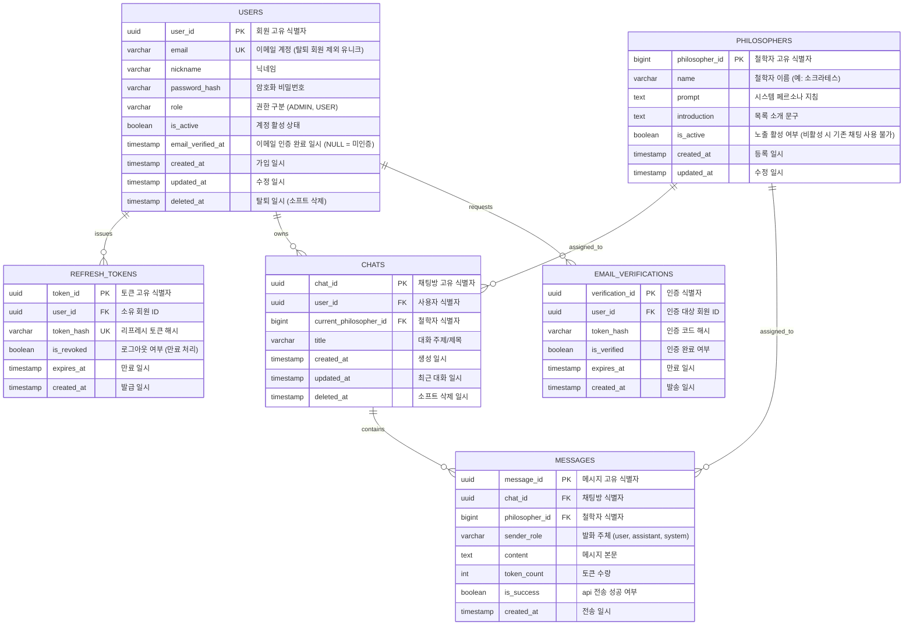

```mermaid
erDiagram
    USERS ||--o{ REFRESH_TOKENS : "issues"
    USERS ||--o{ CHATS : "owns"
    USERS ||--o{ EMAIL_VERIFICATIONS : "requests"
    PHILOSOPHERS ||--o{ CHATS : "assigned_to"
    PHILOSOPHERS ||--o{ MESSAGES : "assigned_to"
    CHATS ||--o{ MESSAGES : "contains"

    USERS {
        uuid user_id PK "회원 고유 식별자"
        varchar email UK "이메일 계정 (탈퇴 회원 제외 유니크)"
        varchar nickname "닉네임"
        varchar password_hash "암호화 비밀번호"
        varchar role "권한 구분 (ADMIN, USER)"
        boolean is_active "계정 활성 상태"
        timestamp email_verified_at "이메일 인증 완료 일시 (NULL = 미인증)"
        timestamp created_at "가입 일시"
        timestamp updated_at "수정 일시"
        timestamp deleted_at "탈퇴 일시 (소프트 삭제)"
    }

    EMAIL_VERIFICATIONS {
        uuid verification_id PK "인증 식별자"
        uuid user_id FK "인증 대상 회원 ID"
        varchar token_hash "인증 코드 해시"
        boolean is_verified "인증 완료 여부"
        timestamp expires_at "만료 일시"
        timestamp created_at "발송 일시"
    }

    REFRESH_TOKENS {
        uuid token_id PK "토큰 고유 식별자"
        uuid user_id FK "소유 회원 ID"
        varchar token_hash UK "리프레시 토큰 해시"
        boolean is_revoked "로그아웃 여부 (만료 처리)"
        timestamp expires_at "만료 일시"
        timestamp created_at "발급 일시"
    }

    PHILOSOPHERS {
        bigint philosopher_id PK "철학자 고유 식별자"
        varchar name "철학자 이름 (예: 소크라테스)"
        text prompt "시스템 페르소나 지침"
        text introduction "목록 소개 문구"
        boolean is_active "노출 활성 여부 (비활성 시 기존 채팅 사용 불가)"
        timestamp created_at "등록 일시"
        timestamp updated_at "수정 일시"
    }

    CHATS {
        uuid chat_id PK "채팅방 고유 식별자"
        uuid user_id FK "사용자 식별자"
        bigint current_philosopher_id FK "철학자 식별자"
        varchar title "대화 주제/제목"
        timestamp created_at "생성 일시"
        timestamp updated_at "최근 대화 일시"
        timestamp deleted_at "소프트 삭제 일시"
    }

    MESSAGES {
        uuid message_id PK "메시지 고유 식별자"
        uuid chat_id FK "채팅방 식별자"
        bigint philosopher_id FK "철학자 식별자"
        varchar sender_role "발화 주체 (user, assistant, system)"
        text content "메시지 본문"
        int token_count "토큰 수량"
        boolean is_success "api 전송 성공 여부"
        timestamp created_at "전송 일시"
    }
```
