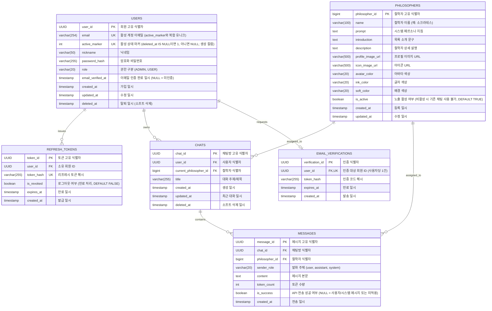

> 모든 `uuid` 컬럼은 MariaDB 네이티브 `UUID` 타입으로 저장하며, `CHAR(32)` 호환 저장 방식을 사용하지 않는다.

```mermaid
erDiagram
    USERS ||--o{ REFRESH_TOKENS : "issues"
    USERS ||--o{ CHATS : "owns"
    USERS ||--o| EMAIL_VERIFICATIONS : "requests"
    PHILOSOPHERS ||--o{ CHATS : "assigned_to"
    PHILOSOPHERS ||--o{ MESSAGES : "assigned_to"
    CHATS ||--o{ MESSAGES : "contains"

    USERS {
        UUID user_id PK "회원 고유 식별자"
        varchar(254) email UK "활성 계정 이메일 (active_marker와 복합 유니크)"
        int active_marker UK "활성 상태 마커 (deleted_at IS NULL이면 1, 아니면 NULL; 생성 컬럼)"
        varchar(50) nickname "닉네임"
        varchar(255) password_hash "암호화 비밀번호"
        varchar(20) role "권한 구분 (ADMIN, USER)"
        timestamp email_verified_at "이메일 인증 완료 일시 (NULL = 미인증)"
        timestamp created_at "가입 일시"
        timestamp updated_at "수정 일시"
        timestamp deleted_at "탈퇴 일시 (소프트 삭제)"
    }

    EMAIL_VERIFICATIONS {
        UUID verification_id PK "인증 식별자"
        UUID user_id FK, UK "인증 대상 회원 ID (사용자당 1건)"
        varchar(255) token_hash "인증 코드 해시"
        timestamp expires_at "만료 일시"
        timestamp created_at "발송 일시"
    }

    REFRESH_TOKENS {
        UUID token_id PK "토큰 고유 식별자"
        UUID user_id FK "소유 회원 ID"
        varchar(255) token_hash UK "리프레시 토큰 해시"
        boolean is_revoked "로그아웃 여부 (만료 처리, DEFAULT FALSE)"
        timestamp expires_at "만료 일시"
        timestamp created_at "발급 일시"
    }

    PHILOSOPHERS {
        bigint philosopher_id PK "철학자 고유 식별자"
        varchar(100) name "철학자 이름 (예: 소크라테스)"
        text prompt "시스템 페르소나 지침"
        text introduction "목록 소개 문구"
        text description "철학자 상세 설명"
        varchar(500) profile_image_url "프로필 이미지 URL"
        varchar(500) icon_image_url "아이콘 URL"
        varchar(20) avatar_color "아바타 색상"
        varchar(20) ink_color "글자 색상"
        varchar(20) soft_color "배경 색상"
        boolean is_active "노출 활성 여부 (비활성 시 기존 채팅 사용 불가, DEFAULT TRUE)"
        timestamp created_at "등록 일시"
        timestamp updated_at "수정 일시"
    }

    CHATS {
        UUID chat_id PK "채팅방 고유 식별자"
        UUID user_id FK "사용자 식별자"
        bigint current_philosopher_id FK "철학자 식별자"
        varchar(255) title "대화 주제/제목"
        timestamp created_at "생성 일시"
        timestamp updated_at "최근 대화 일시"
        timestamp deleted_at "소프트 삭제 일시"
    }

    MESSAGES {
        UUID message_id PK "메시지 고유 식별자"
        UUID chat_id FK "채팅방 식별자"
        bigint philosopher_id FK "철학자 식별자"
        varchar(20) sender_role "발화 주체 (user, assistant, system)"
        text content "메시지 본문"
        int token_count "토큰 수량"
        boolean is_success "API 전송 성공 여부 (NULL = 사용자/시스템 메시지 또는 미적용)"
        timestamp created_at "전송 일시"
    }
```
